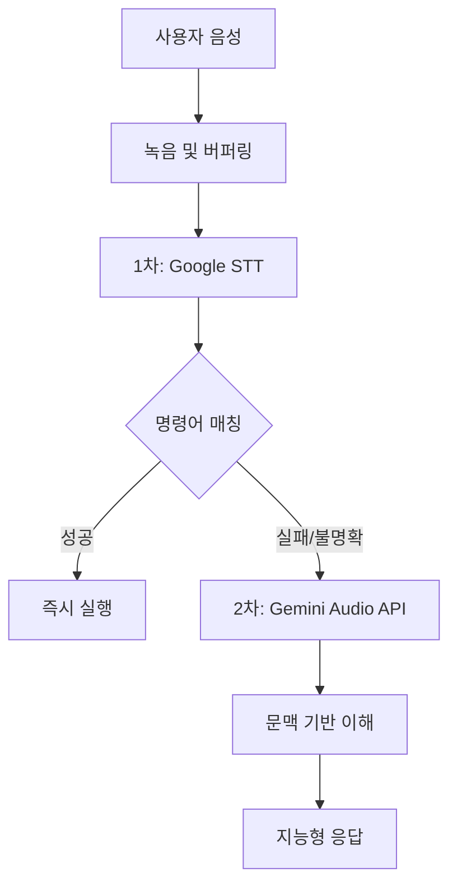

# 하이브리드 음성 처리 시스템 (Hybrid Voice Processing System)

## 개요

Driving English의 하이브리드 음성 처리 시스템은 Google Speech-to-Text와 Gemini Audio API를 효율적으로 결합하여 운전 중에도 정확하고 빠른 음성 인터페이스를 제공합니다.

## 시스템 아키텍처

### 2단계 처리 구조



### 주요 특징

1. **빠른 응답성**: 명확한 명령어는 STT로 즉시 처리
2. **높은 정확도**: 복잡한 요청은 Gemini의 문맥 이해 활용
3. **비용 효율성**: 필요한 경우에만 Gemini API 사용
4. **자연스러운 대화**: 문맥을 이해하는 지능형 응답

## 구현 상세

### 1. 클라이언트 측 (React)

#### useHybridSpeechRecognition Hook

```typescript
// 주요 상태
type ProcessingStatus = 'idle' | 'recording' | 'processing_stt' | 'processing_gemini' | 'success' | 'error';

// Hook 인터페이스
interface UseHybridSpeechRecognitionReturn {
  isRecording: boolean;
  status: ProcessingStatus;
  lastTranscript: string | null;
  lastIntent: string | null;
  startRecording: () => Promise<void>;
  stopRecording: () => void;
  cancelRecording: () => void;
}
```

#### 음성 녹음 설정

- **포맷**: `audio/webm;codecs=opus`
- **샘플레이트**: 16kHz
- **채널**: 모노
- **침묵 감지**: 2초간 무음 시 자동 종료

### 2. 서버 측 (Next.js API Routes)

#### A. STT 1차 처리 (/api/stt-command)

**입력**:
```json
{
  "audio": "data:audio/webm;base64,..."
}
```

**출력 (성공)**:
```json
{
  "type": "command",
  "payload": "NEXT_NEWS",
  "transcript": "다음 뉴스 읽어줘",
  "confidence": 0.95
}
```

**출력 (폴백 필요)**:
```json
{
  "type": "fallback",
  "transcript": "아... 그거 있잖아...",
  "reason": "low_confidence"
}
```

#### B. Gemini 2차 처리 (/api/gemini-audio)

**입력**:
```json
{
  "audio": "data:audio/webm;base64,...",
  "context": {
    "previousTranscripts": ["이전 대화 내용"],
    "currentNewsId": "news-123"
  }
}
```

**출력**:
```json
{
  "transcription": "아까 읽던 그 기사 다시 읽어줘",
  "intent": "repeat_previous_news",
  "confidence": 0.92,
  "response": "네, 이전에 읽던 '전기차 시장 동향' 기사를 다시 읽어드리겠습니다.",
  "context": {
    "referredNewsId": "news-122"
  }
}
```

### 3. 명령어 패턴 매칭

#### 명확한 명령어 (STT로 처리)

```typescript
const CLEAR_COMMANDS = {
  NAVIGATION: [
    { patterns: ['다음', '넥스트', 'next'], command: 'NEXT_NEWS' },
    { patterns: ['이전', '백', 'back', 'previous'], command: 'PREV_NEWS' },
    { patterns: ['일시정지', '일시 정지', '스톱', 'pause', 'stop'], command: 'PAUSE' },
    { patterns: ['재생', '플레이', 'play', 'resume'], command: 'RESUME' },
  ],
  CONTROL: [
    { patterns: ['반복', '다시', 'repeat', 'again'], command: 'REPEAT' },
    { patterns: ['종료', '끝', 'exit', 'quit'], command: 'EXIT' },
  ],
  SETTINGS: [
    { patterns: ['빠르게', '속도 올려', 'faster'], command: 'SPEED_UP' },
    { patterns: ['천천히', '속도 내려', 'slower'], command: 'SPEED_DOWN' },
  ]
};
```

#### 복잡한 요청 (Gemini로 처리)

- 문맥 참조: "아까 그거", "방금 전 기사"
- 감정 표현: "이거 너무 어려워", "재미있는 거 없어?"
- 불명확한 발음: 웅얼거림, 방언, 억양
- 복합 명령: "이 기사 건너뛰고 쉬운 거 찾아줘"

### 4. WebSocket 통합 (선택사항)

실시간 스트리밍이 필요한 경우:

```typescript
// 메시지 타입 확장
interface HybridProcessingMessage {
  type: 'hybrid_processing';
  stage: 'stt' | 'gemini';
  interim?: string;
}

interface HybridResultMessage {
  type: 'hybrid_result';
  source: 'stt' | 'gemini';
  command?: string;
  transcript: string;
  response?: string;
}
```

## 성능 최적화

### 1. 오디오 처리

- **압축**: Opus 코덱으로 파일 크기 최소화
- **버퍼링**: 청크 단위 전송으로 메모리 효율성
- **병렬 처리**: STT 실패 시 즉시 Gemini 호출

### 2. API 최적화

- **캐싱**: 자주 사용되는 명령어 결과 캐싱
- **타임아웃**: STT 3초, Gemini 5초
- **재시도**: 네트워크 오류 시 1회 재시도

### 3. 사용자 경험

- **즉각적 피드백**: 상태 변경 시 UI 즉시 업데이트
- **진행 표시**: 처리 단계별 시각적 피드백
- **오류 처리**: 명확한 오류 메시지와 대안 제시

## 구현 체크리스트

- [ ] Google Cloud 서비스 계정 생성
- [ ] Speech-to-Text API 활성화
- [ ] Gemini API 키 발급
- [ ] 환경변수 설정
- [ ] useHybridSpeechRecognition Hook 구현
- [ ] STT API 엔드포인트 구현
- [ ] Gemini API 엔드포인트 구현
- [ ] 명령어 패턴 정의
- [ ] 오디오 포맷 변환 로직
- [ ] 에러 처리 및 폴백
- [ ] 테스트 케이스 작성
- [ ] 성능 모니터링

## 환경변수 설정

```env
# Google Cloud
GOOGLE_APPLICATION_CREDENTIALS=./service-account.json
GOOGLE_CLOUD_PROJECT_ID=your-project-id

# Gemini
GEMINI_API_KEY=your-gemini-api-key

# 옵션
SPEECH_RECOGNITION_TIMEOUT=3000
GEMINI_PROCESSING_TIMEOUT=5000
AUDIO_SAMPLE_RATE=16000
```

## 테스트 시나리오

### 1. 명확한 명령어 테스트
- "다음 뉴스" → NEXT_NEWS
- "일시정지" → PAUSE
- "빠르게" → SPEED_UP

### 2. 복잡한 요청 테스트
- "아까 읽던 거 다시"
- "이거 말고 다른 주제로"
- "좀 더 쉬운 기사 없어?"

### 3. 에러 케이스
- 무음 입력
- 노이즈만 있는 입력
- 네트워크 오류

## 향후 개선 사항

1. **실시간 스트리밍**: WebSocket으로 완전한 실시간 처리
2. **다국어 지원**: 영어, 일본어 등 추가
3. **개인화**: 사용자별 명령어 패턴 학습
4. **오프라인 모드**: 기본 명령어는 오프라인 처리